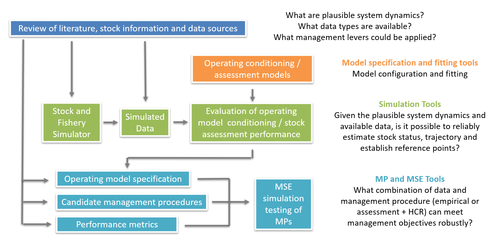

&nbsp;


<style>
  .col2 {
    columns: 2 200px;         /* number of columns and width in pixels*/
    -webkit-columns: 2 200px; /* chrome, safari */
    -moz-columns: 2 200px;    /* firefox */
  }
  .col3 {
    columns: 3 100px;
    -webkit-columns: 3 100px;
    -moz-columns: 3 100px;
  }
  .col4 {
    columns: 4 100px;
    -webkit-columns: 4 100px;
    -moz-columns: 4 100px;
  }
</style>  
  
<style type="text/css">

pre code {
  word-wrap: normal;
  white-space: pre;
}
body{ /* Normal  */
   font-size: 12px;
}
td {  /* Table  */
   font-size: 11px;
}
h1 { /* Header 1 */
 font-size: 18px;
 color: DarkBlue;
}
h2 { /* Header 2 */
 font-size: 15px;
 color: DarkBlue;
}
h3 { /* Header 3 */
 font-size: 14px;
 color: DarkBlue;
}
code.r{ /* Code block */
  font-size: 10px;
}
pre { /* Code block */
  font-size: 10px;
  overflow-x: auto;
}
</style>


***


***

&nbsp;


***

```{r setup, include=FALSE}
library(dplyr)
library(kableExtra)
library(readxl)

knitr::opts_chunk$set(echo = FALSE)

maketab <- function(dir,Alab="Statistical Area"){
  filenam = list.files(dir)
  nf = length(filenam)
  DF = data.frame(filenam)
  names(DF) = c("Area")
  #filepath = list.files(dir, full.names = T, include.dirs = T)
  fit.link = paste0('<a href=', file.path(dir, filenam), '> ', DF$Area , ' </a>')
  DF$Area <- fit.link
  DT::datatable(DF, escape=1,
                colnames=c(Alab),
                filter = 'top',
                options = list(
                  pageLength = 10, 
                  autoWidth = TRUE,
                  sDom  = '<"top">lrt<"bottom">ip'))
}


getprojectinfo<-function(page){
  tab=as.data.frame(read_excel("Project_Info/Status Assumptions To do.xlsx", sheet = page))
  tab=tab[,2:3]
  tab[is.na(tab)]=""
  kable(tab,"simple")#,col.names=rep("",2)) 
}
  

getprog<-function(page){
  tab=as.data.frame(read_excel("Project_Info/Progress.xlsx", sheet = page))
  tab=tab[,2:3]
  tab[is.na(tab)]=""
  kable(tab,"simple")#,col.names=rep("",2)) 
}
  


```


# Overview

The management of short-lived species is challenging: a small number of cohorts provides attenuated information about exploitaiton and can generate high natural variability, data lags can prevent appropriately responsive management, environmental drivers of stock status may mask management performance and seasonality in recruitment, growth and survival may need to be accounted for. 

The slMSE package is a suite of stock and fishery simulation tools for identifying reliable stock assessment methods, conditioning operating models for management strategy evaluation and for the design and testing of candidate management procedures appropriate for short-lived species that may rely on input controls, in-season data collection and in-season management decision making. 

<br>

***

# Project details

```{r ProjDets, eval=T}
dat<-data.frame(c("Term","Funder","Stream","Contract ID #.","PO #","Project Partner","Blue Matter Team","Pew Collaborators"),
                
                 c("January 2026 - September 2028",
                   "Pew Charitable Trusts",
                   "Pew International Fisheries",
                   "39050",
                   "18501",
                   "Blue Matter Science Ltd.",
                   "Tom Carruthers, Adrian Hordyk, Quang Huynh",
                   "Ashley Wilson"))

kable(dat,"simple",col.names=rep("",2)) 
 

```

<br>

***

# Objective

To develop, test and document methods that facilitate the MSE testing of stock assessment methods and management procedures for short-lived species such as squid, shrimp and small pelagics. 

Through the delivery of public-facing scientific reports, open-source tools, and capacity-building activities, the project aims to contribute directly to the advancement of ecosystem-based fisheries management for short-lived species (with an initial focus on squid stocks) on a global scale. 


<br>

***

# Introduction

## Management Challenges of Short-Lived Species

For many fish stocks, population and fishery dynamics are approximated well by models that have an annual time step. These stocks typically have annual recruitment and annual data collection. The population comprises multiple cohorts and recent data may be informative about current stock status and management recommendations may be suitably responsive. Since management recommendations are often aligned with annual timesteps (e.g., ‘2027 TAC advice will remain constant at 2026 levels’) most stock assessment models are specified on an annual time step.

For the purposes of this project, we define a short-lived species as one that may not be approximated well by annual population and fishing dynamics and may require the use of in-season data. In broad quantitative terms this is a species that naturally lives for less than three years; has an annual instantaneous mortality of greater than 1.0, for which 95% of individuals naturally die before 36 months. Examples of such species include most stocks of shrimp, squid, octopus and anchovy.

The management challenges of such species are not related to longevity per se, but instead arise due to the relative frequencies of recruitment, data collection and management decision making. A fish that lives to one year and has monthly recruitment, monthly data collection and monthly management interventions is no different mathematically than a fish that lives to 12 years and has annual recruitment data collection and management decision making. However most short-lived species are not managed on a monthly time step. Consider a fish such as a sardine that lives to three years, recruits in a single month of the year and uses data from the previous year for management decision making. That is mathematically equivalent to a fish that lives to 36 years recruits every 12 years, sets advice from data from 12 years ago (the data point before that is 24 years ago) and for which management will be kept constant for 12 years at a time. Rephrased in those terms, it is easy to see why managing such a stock would be challenging. A retrospective analysis of TAC management for such a stock would almost certainly show unacceptable management performance due to those data lags and unresponsive management (unless a very conservative TAC was prescribed).

It follows that the ‘short-lived management problem’ is multifaceted and includes one or more of the following:

*	High natural variability in stock level due to few cohorts (perhaps only one) limiting forecasting certainty and lessening impact of alternative management options;

* fewer cohorts retain limited information about past exploitaiton rate and hence the scale of the stock;

*	Data lags that span a high degree of uncertainty in stock status (available data may be 'out of date' and uninformative about an appropriate current management policy);

*	Management that does not occur frequently enough to adequately respond to changes in stock and fishery dynamics; 

*	Environmental drivers of stock level may be more influential than management decisions;

*	Conventional fisheries management reference points that may not be suitable. 


## Squid Fisheries

Squid are ecologically significant species that play important roles in marine ecosystems—as predators and as critical forage for higher trophic level species. Their populations are characterized by short lifespans (typically around one year), rapid growth, semelparous reproduction, and high natural mortality. These biological characteristics lead to strong and often unpredictable fluctuations in abundance that can be closely linked/driven by environmental variability.

Traditional stock assessment approaches used for longer-lived finfish often fall short when applied to squid fisheries. Squid’s fast turnover, protracted spawning periods, and responsiveness to short-term environmental changes present unique challenges for developing robust, responsive management strategies. While several squid fisheries worldwide have applied models such as depletion-based models [e.g., jumbo flying squid (Dosidicus gigas) in the Gulf of California and in Chilean fisheries, Japanese common squid (Todarodes pacificus) in Japan, Argentine shortfin squid (Illex argentinus) and Patagonian longfin squid (Doryteuthis gahi) in the Falkland Islands], Bayesian hierarchical DeLury models (e.g., neon flying squid (Ommastrephes bartramii) in the North Pacific Ocean], surplus production models (e.g., SPiCT), per-recruit models and empirical/heuristic models management (see Arkhipkin et al 2021, NPFC, 2025),  most still struggle with data limitations, the apparent need for near-real-time management adjustments and associated high monitoring demands.

Moreover, environmental drivers such as sea temperature, climate indices (e.g., El Niño Southern Oscillation, North Atlantic Oscillation), and spatio-temporal variability are known to influence squid abundance and distribution. Some squid species display clear offshore-coastal distribution shifts during spawning periods, which has implications for spatial management and protection of spawning aggregations.

In many instances squid fisheries do not have established monitoring and data collection programmes that facilitate management strategies that reflect their short-lived and environmentally driven fluctuations – making it challenging to have responsive/ sustainable management or even establishing suitable reference points for use by management.


## Management Strategy Evaluation (MSE)

Despite recent advances in squid stock assessment science, there remain significant gaps in:

*	Scientific and management tools that can handle squid’s biological attributes and environmental sensitivity.

*	Management strategies that accommodate high-frequency data needs, in-season management adjustments and define suitable decision rules and reference points.

*	Frameworks that incorporate environmental variability and climate change impacts into management advice.

* Accessible, and fit-for-purpose MSE tools for squid/short-lived species, especially for data-limited contexts.

* Designing suitable monitoring strategies for squid and similar short-lived species.

MSE offers a promising solution to these challenges. MSE allows for the simulation and comparison of alternative management procedures under uncertainty, providing a pathway to developing harvest strategies (also known as management procedures – MPs) that are both scientifically sound and practically implementable, even when ecological processes are not fully understood.

This project builds on the growing recognition by regional fisheries management organisations (RFMOs) and the global scientific community of the need for more responsive, climate-ready fisheries management. There is a growing call for better management of the partially regulated and unregulated squid fisheries globally.


## Research Goals

This research project aims to develop tools that can support the design, evaluation, and potential adoption of effective, science-based management procedures (MPs, aka 'harvest strategies') for squid and other species with similar short-lived, variable life histories. The project will develop an  MSE package based on the openMSE platform that can be adapted for different fisheries, whether data-limited, data-moderate, or data-rich.

By leveraging existing research and developing Operating Models (OMs) tailored to squid biology and fishery dynamics, the project seeks to provide flexible, accessible MSE tools that managers and scientists can use to develop MPs for squid stocks globally, regardless of their current data or assessment capacity. These tools will enable the development and evaluation of model-based and empirical MPs, which include management considerations that may be important for squid in-season catch/effort limit adjustments, spatial measures, and environmentally responsive strategies.

A key focus will be to support the North Pacific Fisheries Commission (NPFC) and the South Pacific Regional Fisheries Management Organisation (SPRFMO) in advancing MSE for their main squid fisheries—specifically, the NPFC neon flying squid, NPFC Japanese flying squid, and the SPRFMO jumbo flying squid stocks. 

The project will also explore how improved monitoring strategies (e.g., enhanced data collection, reduced data lags, and more frequent in-season updates) might reduce uncertainty and improve management outcomes for these fisheries.
The project will provide:

* A globally applicable short-lived MSE tool for OpenMSE.

*	Case study applications and MSE analyses for NPFC and SPRFMO squid fisheries.

*	Climate and environmental responsiveness and robustness testing methods for squid MPs.

*	Capacity-building opportunities through bespoke training and workshops to enhance understanding and use of these new MSE frameworks for squid and similar species.


## Audience

The primary target audiences for this work include:

*	Scientists and managers within RFMOs (e.g., NPFC and SPRFMO).

*	The broader global scientific community developing stock assessment and MSE methods for squid and other short-lived species.

*	Stakeholders involved in sustainable management of squid and related fisheries, seeking adaptive, climate-ready, ecosystem-based approaches.


&nbsp;

***

# Methods

## Overview

A collection of tools are available in a public slMSE R package that allow users to specify simulation models that can be used to test assessment methods (and operating model conditioning methods), and develop management procedures and then test those using the OpenMSE R libraries. 

The intention of slMSE is to support a scientific process that begins with a collection of available data and information, leads to the consolidation of those in a range of plausible scenarios for system dynamics, this followed by a defensible assessment of the resource, and finally the development and potentially adoption of management procedures that are demonstrably robust to scientific and management uncertainties. 

Data & information > (1) Simulated dynamics > (2) Assessment > (3) Management procedure




Figure 1. Suggested methodological steps. 

1. Simulation of Fishery Dynamics

2. Assessment Evaluation Operating Model Conditioning

3. Management Procedure Development and Testing


## Installation

The short-lived tools and MSEtool dependencies can be installed from the slMSE library: 

```{r Installation, eval=F, echo=T}

remotes::install_github("Blue-Matter/MSEtool", ref= "prelease") # Latest version of MSEtool
remotes::install_github("Blue-Matter/slMSE")                    # Latest version of slMSE
remotes::install_github("DTUAqua/spict/spict")                  # SPiCT assessment

slMSE::slTest()

```

## Specifying Seasonal Operating Models for Simulating Data

The slMSE package comes with functions that specify stock and fleet dynamics. These default to a quarterly, three area model of three stocks that varying in their longevity, maturity, growth, ontogyny, spatial distribution, recruitment seasonality and magnitude, and two fleets of varying selectivity, seasonality, spatial distribution and exploitation rate. 

These are essentially wrapper functions around customizable stock and fleet builders which we will return to below. 

First the 'shape' of the simulation needs to be specified: 

```{r omshape, eval=F, echo=T}
nYear = 25          # No. historical years
pYear = 15          # No. projection years
Seasons = 4         # time steps, subyears/seasons per year (two-monthly)
nAreas = 3          # 3 areas used to simulate ontogeny and fleet distribution
nAges = 8           # calculations run to 2 years
nSim = 24           # a small number of simulations for demo purposes
CurrentYear = 2026  # 'Today'
```

These are arguments to the generic simulator functions: 

```{r specOM, eval=T, echo=T}
stock = demo_stocks(nYear, pYear, Seasons, nSim, nAges, CurrentYear) # a list of 3 stocks
fleet = demo_fleets(nYear, pYear, Seasons, nSim, nAges, stock)       # a list of 2 fleets

om = slOM(stock = stock, fleet = fleet,                  # combine in operating model
          ComplexName = "Pacific JFS",
          nSim = nSim, nYear = nYear, pYear = pYear,
          Seasons = Seasons, CurrentYear = CurrentYear,
          Interval = 6, Seed = 1)

```

This creates an MSEtool (OpenMSE v2.0) compatible operating model of class 'om'

To find out more about these and how they are built you can refer to the in-line help documentation: 

```{r MSEtool_help, eval=F, echo=T}

class?om
?Stock   # Stock sub-class
?Fleet   # Fleet sub-class
?Imp     # Implementation model sub-class
?Obs     # Observatoin model sub-class

```


To undertake a historical simulation you use the Simulate function and plot what this output looks like: 

```{r Simulate, eval = T, echo=T}
hist = Simulate(om)   # Historical simulation
slplot(hist)          # Summary plot of dynamics
```

Note that this historical reconstruction can be used to do projections in conventional MSE analyses using openMSE: 

```{r OptionalMSE, eval = T, echo = T}

avail('mp')                                      # Available MSEtool MPs
myMSE = Project(hist, MPs = "CurrentEffort")     # Projection - current effort
B = Biomass(myMSE)                               # Extract Biomass

Bplot = do.call(data.frame,                      # Obtain quantiles
                aggregate(Value~Year,data = B, quantile,
                          probs=c(0.05,0.5,0.95)))

ggplot(Bplot) +                                  # Plot biomass
  geom_ribbon(aes(x=Year,ymin = Value.5.,ymax=Value.95.),fill = "steelblue2") +
  geom_line(aes(y=Value.50.,x=Year)) +
  geom_vline(xintercept = myMSE@OM@CurrentYear)

```

Instead we will focus on generating simulated data and testing assessment methods.

## Generating Simulated data

The historical simulation object hist contains a lot of infomation for example: exploitation rate, biomass, spanwing biomass, MSY reference points etc. 

It also includes simulated datasets (a dataset for each simulation). You can extract those data types that may be typically available to an assessment. In this case these are annual and quarterly catches, catch-length composition data, catch rate indices (vulnerable biomass by fleet) and a fishery independent survey (total biomass). 

```{r OptionalMSE, eval = T, echo = T}
simdata = slSimData(hist)                        # Generate simulated data
slplot(simdata)                                  # plot simulated data
```

You now have multiple simulated datasets and also some 'true' known simulated quantities in the simdata object. These can be used to fit assessment models to evaluate how well they can estimate simulated quantities such as stock size and exploitation rate. Relevant questions are:

* What is the correct temporal resolution of the stock assessment model (e.g., annual vs quarterly)
* What type of assessment model can best approximate stock dynamics (e.g., is a surplus produciton model suitable)
* Can these assessments be reconfigured to performance better?

### SPiCT (Surplus Production in Continuous Time, DTU Aqua)

SPiCT is a surplus production model using the generalized model of Pella and Tomlinson. It is implemented in TMB, inlcudes the continuous impelmentation of the production equations and can also approximate seasonality. The key advantages of SPiCT are that it is fast, customizable (you can configure it to better approximate simulated dynamics), can include prior information for more robust estimation performance and it can be run on a finer temporal resolution to approximate seasonality. 

Lets fit SPiCT to a single simulated dataset:

```{r Spict_single, eval = F, echo=T}
Sout = do_spict(sim = 1, simdata)     # Fit spict (default settings) for sim 1
plot(Sout$fit)                        # Generic SPiCT fitting report
```

If you take a look at the documentation for do_spict() you will see that a large number of default priors and other assumptions such as observaiton error and process error, were imposed on this fit. You can fiddle around with these if you like - maybe you can fit the simulated data better?

```{r spict_help, eval = F, echo=T}
?do_spict                     # in-line slMSE help
```

The focus of this package however is the simulation testing of assessment estimation performance. Let's do a full sim-sam (simulation - stock assessment model) for all 24 simulations and summarize the estimation performance:

```{r Spict_SimSam, eval = F, echo = T}
# Sim-Sam all simulations
SS_spict = SimSam_spict(simdata, timestep = "year",   # annual sim sam
                        parallel = T,                 # use parallel processing
                        r.pr = c(0.8,0.2,1),          # r prior
                        bk.pr = c(0.5,0.3,1),         # initial depletion prior
                        shape.pr = c(2, 0.001, 1),    # shape prior (about 0.4)
                        oe = c(0.2, 0.5, 1),          # Index observation error
                        pe = c(0.5, 0.5, 1),          # process error
                        fdevs = c(4, 0.5, 1),         # F deviation penalty
                        ce = c(0.05, 0.001, 1),       # Catch obs error
                        q.pr = NULL,                  # index q prior
                        timing = 0.01,                # index timing (within ts)
                        dteuler = 0.25)               # resolution of cont func.

slplot(SS_spict)                                      # plot sim sam results
```

That is the result for the annual model with the configuration (priors, errors etc) specified. 

Lets try a quarterly assessment instead:

```{r Spict_SimSam_q, eval = F, echo = T}
# One simulation
Sout_q = do_spict(sim = 1, simdata, timestep = "quarter", dteuler = 0.05)
plot(Sout_q$fit)                                  # generic SPiCT fitting report

# Sim-Sam all simulations
SS_spict_q = SimSam_spict(simdata, timestep = "quarter",
                          parallel = T,               # use parallel processing
                          r.pr = c(0.8,0.2,1),        # r prior
                          bk.pr = c(0.5,0.3,1),       # initial depletion prior
                          shape.pr = c(2, 0.001, 1),  # shape prior (about 0.4)
                          oe = c(0.2, 0.5, 1),        # Index observation error
                          pe = c(0.5, 0.5, 1),        # process error
                          fdevs = c(4, 0.5, 1),       # F deviation penalty
                          ce = c(0.05, 0.001, 1),     # Catch obs error
                          q.pr = NULL,                # index q prior
                          timing = 0.01,              # index timing (within ts)
                          dteuler = 0.25)             # resolution of cont func.

slplot(SS_spict_q)                                    # plot sim sam results

```

This might be a good time to think about how to reconfigure this spatially-aggregated, single-stock, single-fleet assessment model to better approximate the dynamics of the spatial, multi-stock, multi-fleet simulation model...

### RCM (Rapid Conditioning Model, of SAMtool, Huynh 2026)

The openMSE libraries include SAMtool (Stock Assessment Methods toolkit of Quang Huynh). Inlcuded in that package is RCM, a flexible, rapid operating model conditioning approach, implemented in TMB that can be run in a wide variety of configurations for varying input data types. 

Here we will simulation test RCM in two modes which are possibly more appropriate for high-season short-lived stocks such as Neon Flying Squid and Jumbo Flying Squid: Age-Structured Production Model (ASPM) and Statistical Catch at Length (SCAL). ASPMs are just the typical age-structured stock assessment but with user-specified vectors for selectivity. Such a model correctly accounts for lags introduced by cohorts and can accomodate assumptions not well approximated by production models such as large mismatches in maturity-at-age ogives and selectivity-at-age. 

SCAL models are identical to the ASPMs but instead of user-specified fishery selectivity these estimate selectivity from catch-length composition data. Typically length data for short-lived stocks do not include much information about exploitation due to the small number of cohorts and high degree of natural mortality. Typically, size composition data will have limited impact on the estimation of scale but can inform selectivity-dependent reference points such as FMSY and can also prevent assessments from estimating spurious recruitments (this can be an issue with ASPM models).

By default both ASPM and SCAL models are implemented on a quarterly time steps (there would not be sufficient resolution of age and time for a stock that lives to only two years). 

Let's see how they simulation test, starting with ASPM:

```{r RCM_ASPM, eval = F, echo = T}
# One simulation
Rout = do_RCM(1, simdata)   # fit RCM default args in ASPM model for sim 1
plot(Rout$fit)

# Sim-Sam all simulations
SS_RCM_ASPM = SimSam_RCM(simdata, Name = "JFS demo",
                    mode = "ASPM",
                    c_oe = 0.05,
                    i_oe = 0.2,
                    ESS = 50,
                    C_eq_fac = 1,
                    C_eq_nyrs = 5,
                    nsubyr = 4,
                    R0init = 1E7,
                    M = 0.5,
                    Len_age = NA,
                    Wt_age = NA,
                    Mat_age = NA,
                    Sel_age = NA,
                    Steepness = 0.8,
                    SRrel = 2,
                    pe = 5.0,
                    max_F = 3.0)

slplot(SS_RCM_ASPM)
```

Now SCAL:

```{r RCM_SCAL, echo=T, eval = F}
Rout = do_RCM(1, simdata, mode = "SCAL") # fit RCM SCAL model for sim 1
plot(Rout$fit)

# Sim-Sam all simulations
SS_RCM_SCAL = SimSam_RCM(simdata, Name = "JFS demo",
                    mode = "SCAL",
                    c_oe = 0.05,
                    i_oe = 0.15,
                    ESS = 5,
                    C_eq_fac = 1,
                    C_eq_nyrs = 5,
                    nsubyr = 4,
                    R0init = 1E7,
                    M = 0.5,
                    Len_age = NA,
                    Wt_age = NA,
                    Mat_age = NA,
                    Sel_age = NA,
                    Steepness = 0.9,
                    SRrel = 2,
                    pe = 5.0,
                    max_F = 3.0)

slplot(SS_RCM_SCAL)

```

## Conditioning an operating model 

## Specifying Projection dynamics

## Developing In-Season Management Procedures

## Including Environmental Drivers of Stock Productivity

## Quantifying Appropriate Fishery Management Reference Points


<br>

***

# Examples

## Neon Flying Squid

## Jumbo Flying Squid

## Deep Water Red Shrimp

<br>

***

# References

Alexander I Arkhipkin, Lisa C Hendrickson, Ignacio Payá, Graham J Pierce, Ruben H Roa-Ureta, Jean-Paul Robin, Andreas Winter, Stock assessment and management of cephalopods: advances and challenges for short-lived fishery resources, ICES Journal of Marine Science, Volume 78, Issue 2, March 2021, Pages 714–730, https://doi.org/10.1093/icesjms/fsaa038

NPFC, 2025. NPFC-2025-SSC NFS02-WP02. Overview of Stock Assessment Methods and Management Measures Used for Squids and Other Short-Lived Species. https://www.npfc.int/system/files/2025-06/NPFC-2025-SSC%20NFS02-WP02%20Overview%20SA%20Methods%20and%20Management%20Measures.docx

NPFC, 2025. NPFC-2025-SSC NFS02-IP06Management Strategy Evaluation for Short-Lived Species with Only Annual Data: A Case Study of the Autumn Cohort of Neon Flying Squid in the North Pacific Ocean, https://www.npfc.int/system/files/2025-07/NPFC-2025-SSC%20NFS02-IP06%20Data%20moderate%20MSE%20for%20short-lived%20species.pdf


<br>

***


# Acknowledgements

<br>

<span style="font-size: 1.05em; display: block; text-align: center;">Funding support for this project was provided by:

<span style="font-size: 1.25em; display: block; text-align: center;">The Pew Charitable Trusts</span>


&nbsp;&nbsp;&nbsp;

The views expressed herein are those of the authors and do not necessarily reflect the views of The Pew Charitable Trusts.

Contact point for Pew Charitable Trusts - Ashley Wilson, Science Officer, International Fisheries (awilson@pewtrusts.org).

&nbsp;

***

# Appendix: Operating Models

An operating model is a theoretical description of fishery and population dynamics used for the testing of management strategies that could include, for example,  data collection protocols, stock assessment methods, harvest control rules, enforcement policies and reference points. In fisheries, operating models are used in closed-loop simulation to test management procedures (aka. harvest strategy) accounting for feedback among the system, data, management procedure and implementation. A management procedure is a rule that calculates management advice from data. Management Strategy Evaluation uses closed-loop simulation of management procedures as a core technical component but is a wider process of stakeholder and manager engagement that identifies system uncertainties, performance metrics, viable management procedures, ultimately aiming to adopt an MP for the provision of management advice for an established time period. 

&nbsp;

## Reference Case Operating Models

The reference case operating model is used as the single 'base' operating model from which reference set and robustness set operating models are specified. Reference and robustness tests are typically 1-factor departures from the reference case OM, however sometimes reference set OMs are organized in a factorial grid across primary axes of uncertainty. 

&nbsp;

## Reference Set Operating Models

Reference set operating models span a plausible range of the core uncertainties for states of nature. These are often the types of alternative parameterizations or assumptions that would be included in a stock assessment sensitivity analysis. 

The role of the reference set operating models is to provide the central basis for evaluating the performance of candidate management procedures, for example rejecting badly performing harvest strategies. 

&nbsp;

## Robustness Set Operating Models

Robustness set operating models are intended to include additional sources of uncertainty for providing further discrimination among management procedures that perform comparably among reference set operating models. 

Robustness operating models often represent system states of nature that are not empirically informed or are hypotheses of a subset of stakeholders.

&nbsp;
***

&nbsp;&nbsp;&nbsp;&nbsp;&nbsp;&nbsp;&nbsp;&nbsp;&nbsp;&nbsp;&nbsp;&nbsp;

